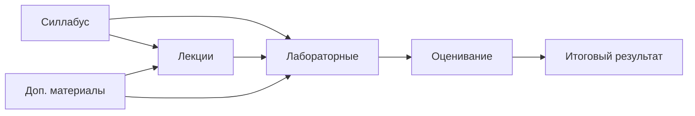

# Шаблон учебного репозитория

> Универсальная структура репозитория для университетской дисциплины: силлабус, лекции, лабораторные, дополнительные материалы и оценивание.

## Быстрая навигация

| Раздел | Назначение |
|---|---|
| [Силлабус](syllabus/README.md) | цели, результаты обучения, политика курса, календарь |
| [Лекции](lectures/README.md) | конспекты, материалы до/после занятия |
| [Лабораторные](labs/README.md) | задания, критерии, шаблоны отчета |
| [Доп. материалы](materials/README.md) | справочники, статьи, практики |
| [Оценивание](assessment/README.md) | рубрики, контрольные точки, итоговая схема |
| [Метаданные](meta/README.md) | соглашения по структуре и Markdown |

## Как использовать шаблон

1. Сделайте репозиторий из этого шаблона.
2. Заполните `syllabus/course.md`.
3. Для каждой темы скопируйте `lectures/00-template.md`.
4. Для каждой лабораторной скопируйте `labs/00-template.md`.
5. Обновите индексные `README.md`.

## Карта курса

> [!TIP]
> Все содержательные элементы курса хранятся в Markdown, поэтому их удобно проверять через Git, обсуждать через Pull Request и автоматически публиковать как сайт документации.
