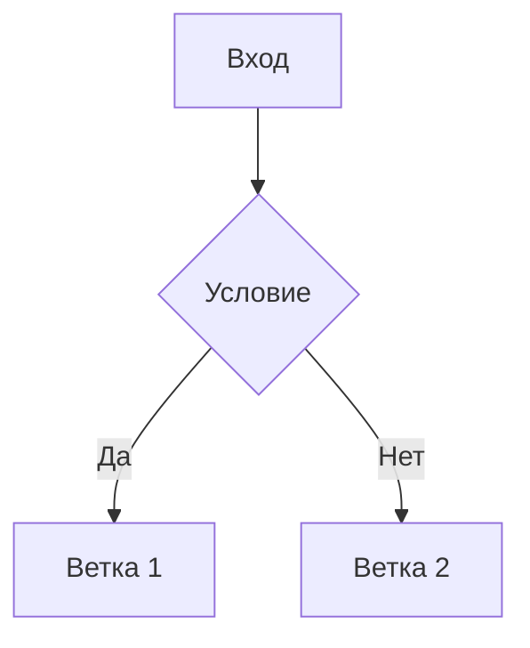

# Лекция 0. Название темы

## Перед лекцией

- [ ] прочитать материал;
- [ ] ответить на вопрос для самопроверки.

## Ключевая идея

> [!NOTE]
> Одно предложение, которое студент должен запомнить после лекции.

## Конспект

### 1. Подтема

Текст, формулы, таблицы, ссылки, код.

```python
print("example")
```

## Схема



## Самопроверка

<details>
<summary>Почему ...?</summary>

Ответ скрыт до раскрытия блока.

</details>

## Связанные материалы

- [Лабораторная](../labs/00-template.md)
- [Дополнительные материалы](../materials/README.md)
