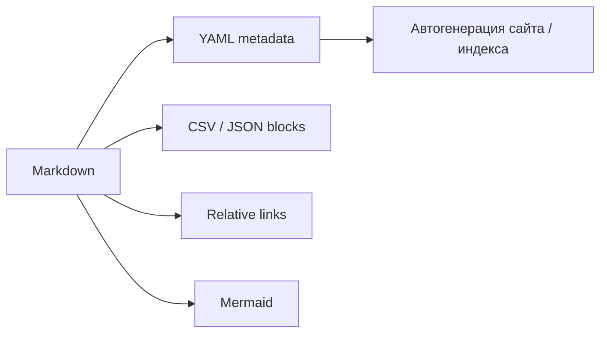

# Каталог данных и файлов

Markdown можно использовать не только как текст, но и как **интерфейс к данным**.

## Подходы

1. **Мини-датасеты прямо в Markdown** — CSV/JSON/YAML в code block.
2. **Относительные ссылки на файлы** — удобно связывать задания и ресурсы.
3. **Ссылки на конкретные строки GitHub** — удобно обсуждать фрагменты данных в issue/PR.
4. **Mermaid** — визуализация потоков данных и зависимостей.
5. **HTML `
`** — скрытые решения, ответы и дополнительные сведения.
6. **Task lists** — отслеживание выполнения лабораторных.
7. **YAML front matter** — машиночитаемые метаданные для генераторов документации.

