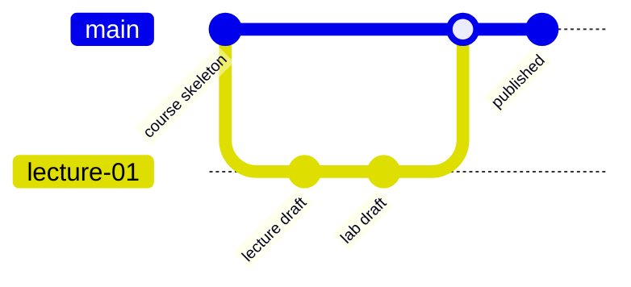

# Соглашения репозитория

## Структура

```text
.
├── syllabus/
├── lectures/
├── labs/
├── materials/
├── assessment/
└── meta/
```

## Правила именования

- `01-topic.md` — тема с номером;
- заголовок H1 — один на файл;
- относительные ссылки вместо абсолютных путей;
- код всегда с указанием языка fenced block;
- каждый учебный файл начинается с кратких метаданных.

## Рекомендуемый workflow


